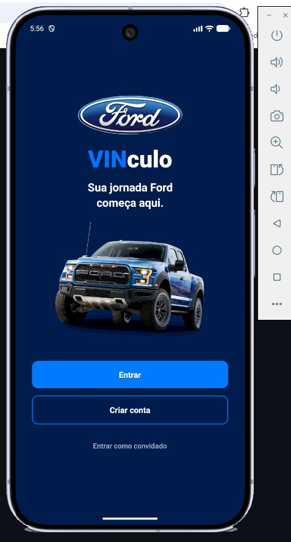

# Ford VINculo

Aplicativo mobile de gestão de veículos Ford, desenvolvido com Expo e React Native.

## O que está implementado

- Tela de boas-vindas;
- Login e cadastro local para demonstração;
- Modo convidado;
- Cadastro e visualização de veículos;
- Lista de veículos da conta e veículos de demonstração;
- Recomendações de manutenção;
- Agendamento com data, horário e concessionária;
- Histórico de serviços e agendamentos;
- Pontuação e recompensas;
- Comparador de veículos com IA via Groq;
- Perfil e edição de dados;
- Configurações de tema, notificações e localização;
- Suporte e perguntas frequentes;
- Tema claro e escuro.

## Demonstração Visual

### Tela de Boas-Vindas



### Tela de Login


### Tela de Cadastro


### Home do Aplicativo


### Tela de Inteligência Artificial


### Tela de Serviços


### Tela de Cadastro de Veículo


### Tela de Perfil


### Demonstração em Vídeo/GIF


## Executar localmente

### Pré-requisitos

- Node.js;
- npm;
- Expo Go ou emulador Android;
- Android Studio (opcional).

### Instalação

```bash
npm install --legacy-peer-deps
```

### Configurar a IA

O app utiliza a API da Groq para comparar veículos. Crie um arquivo `.env` na raiz do projeto:

```env
EXPO_PUBLIC_GROQ_API_KEY=gsk_sua_chave_aqui
```

Não compartilhe a chave em commits, prints ou vídeos. O arquivo `.env` não deve ser versionado. Como o prefixo `EXPO_PUBLIC_` incorpora o valor ao bundle mobile, essa configuração serve apenas para a demonstração acadêmica; em produção, a chamada deve passar por um backend que proteja a chave.

Para builds na nuvem, cadastre a variável `EXPO_PUBLIC_GROQ_API_KEY` no ambiente do EAS em vez de enviar o arquivo `.env` para o repositório.

### Iniciar o app

```bash
npx expo start
```

Para gerar um APK de demonstração com EAS:

```bash
npx eas login
npx eas build --profile preview --platform android
```

## Organização

```text
app/
  (auth)/       login, cadastro e boas-vindas
  (tabs)/       Home, IA, serviços, cadastro de veículo e perfil
src/
  context/      autenticação e tema
  utils/        armazenamento local por usuário
components/    componentes reutilizáveis
assets/        imagens e ícones
screens/       screenshots usados na documentação
```

## Persistência atual

Nesta etapa, o app funciona sem backend Java. Os dados são persistidos localmente com `AsyncStorage`, separados por usuário quando aplicável. O modo convidado utiliza o escopo `guest`.

A API Java/Spring Boot, JWT real, banco de dados, testes de integração e OpenAPI serão adicionados em uma etapa posterior do projeto. A integração atual da IA é direta com a Groq e deve ser migrada para um backend antes de uma versão de produção.

## Segurança e limitações

A autenticação atual é local e serve apenas para demonstração. Senhas não devem ser consideradas seguras em produção. Para a versão final, a autenticação e os dados deverão ser validados por uma API com hash de senha, JWT, HTTPS, controle de acesso e tratamento de erros.

## Identidade visual

O app utiliza uma identidade baseada em Ford, com azul, fundo escuro e suporte a tema claro. Os screenshots em `screens/` devem ser atualizados após uma nova build para refletirem a versão atual.
