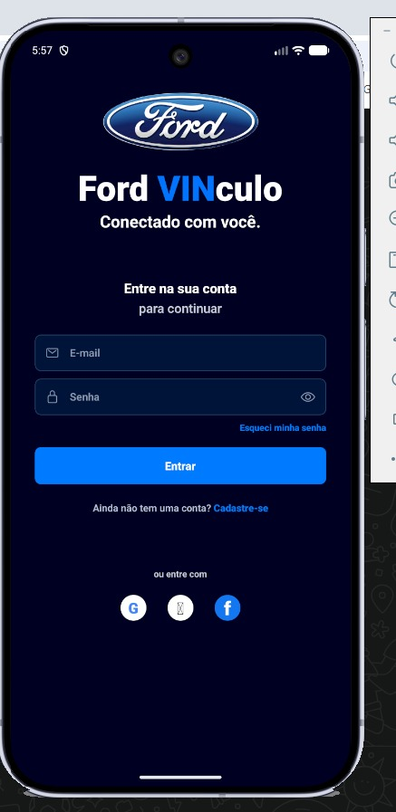
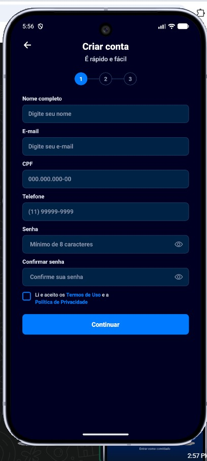
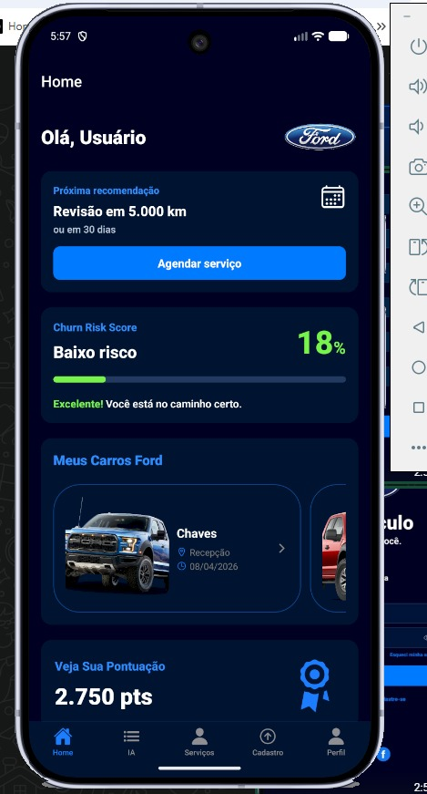
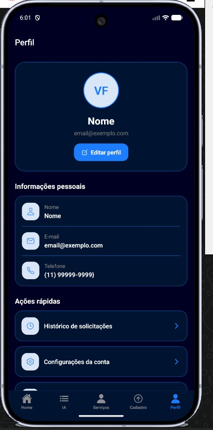
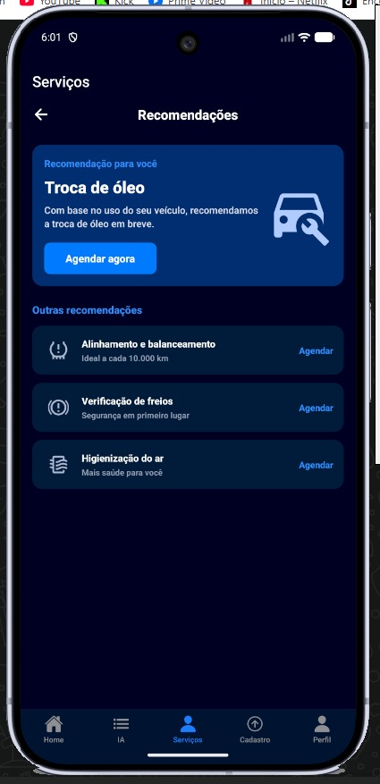
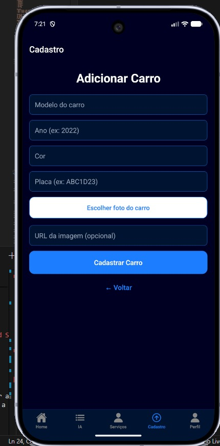
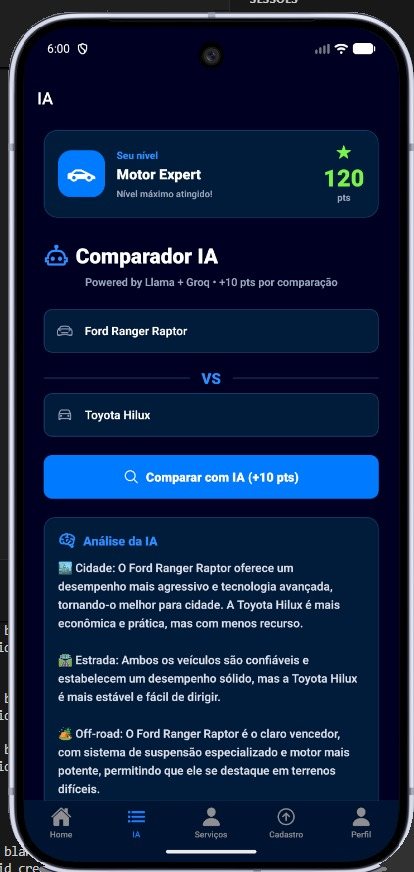
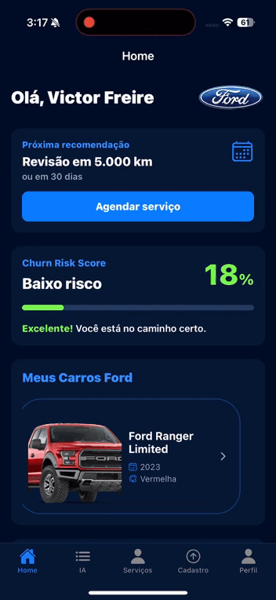

# 🚗 Ford Client Manager App

## 📌 Sobre o Projeto

O **Ford Client Manager App** é um aplicativo mobile desenvolvido com foco no gerenciamento e experiência do cliente da Ford. O projeto foi criado como solução para o desafio proposto pela Ford, com o objetivo de centralizar funcionalidades importantes em um único aplicativo moderno, intuitivo e acessível.

O desafio escolhido pelo grupo teve como foco melhorar a experiência do cliente através de tecnologia mobile, trazendo praticidade no gerenciamento de informações, agendamentos e suporte inteligente.

### 🎯 Objetivo do Desafio

Desenvolver uma solução mobile capaz de melhorar a interação do cliente com a Ford, oferecendo uma experiência mais moderna, organizada e eficiente.

### ❓ Por que escolhemos esse desafio?

O grupo escolheu este desafio por acreditar que a experiência do usuário é um dos pontos mais importantes atualmente para empresas do setor automotivo. A proposta permitiu unir desenvolvimento mobile, interface moderna e integração com inteligência artificial, além de trabalhar conceitos importantes de UX/UI e arquitetura de software.

---

# ⚙️ Funcionalidades Implementadas

✅ Tela de Boas-Vindas

✅ Sistema de Login

✅ Sistema de Cadastro

✅ Navegação entre telas

✅ Home principal do aplicativo

✅ Cards informativos

✅ Tela de Perfil do usuário

✅ Sistema de agendamento

✅ Fluxo de telas organizado

✅ Interface responsiva e moderna

✅ Integração com Inteligência Artificial

✅ Assistente IA para análise/comparação de veículos

✅ Organização de imagens/screenshots para documentação

---

# 👨‍💻 Integrantes do Grupo

| Nome            | RM       |
| --------------- | -------- |
| Enrico Ricarte Rodrigues | RM558571 |
| Pedro Gaspar Fernandes Ferrari | RM554887 |
| Victor Freire Martins Siqueira | RM556191 |

---

# ▶️ Como Rodar o Projeto

## 📋 Pré-requisitos

Antes de começar, você precisará ter instalado em sua máquina:

* Node.js
* npm ou yarn
* Expo CLI
* Git
* Android Studio (opcional para emulador)
* Expo Go no celular

---

## 📥 Clonando o Repositório

```bash
# Clonar repositório
git clone URL_DO_REPOSITORIO

# Entrar na pasta do projeto
cd fiap-mdi-projeto-ford
```

---

## 📦 Instalando Dependências

```bash
npm install
```

ou

```bash
yarn install
```

---

## ▶️ Executando o Projeto

```bash
npx expo start
```

Depois disso:

* Pressione `a` para abrir no Android Emulator
* Ou escaneie o QR Code utilizando o aplicativo Expo Go

---

# 📱 Demonstração Visual

## 🖼️ Prints das Telas

### Tela de Boas-Vindas


---

### Tela de Login



---

### Tela de Cadastro



---

### Home do Aplicativo



---

### Tela de Perfil



---

### Tela de Serviços



---

### Tela de Cadastro Carro


---

### Tela da Inteligência Artificial



---

## 🎥 Demonstração em Vídeo/GIF

Adicione aqui o GIF ou vídeo demonstrando o fluxo principal do aplicativo.

Exemplo:

```md

```

# 🛠️ Decisões Técnicas

## 💻 Stack Utilizada

### Front-end Mobile

* React Native
* Expo
* JavaScript

### Navegação

* Expo Router

### Inteligência Artificial

* Integração com API de IA para análise e comparação de veículos

---

## 🧱 Estrutura do Projeto

O projeto foi organizado utilizando separação por telas, componentes e rotas, facilitando manutenção e escalabilidade.

---

## 🔗 Integrações Realizadas

* Integração com API de Inteligência Artificial
* Navegação dinâmica entre telas
* Fluxo de autenticação
* Organização de rotas utilizando Expo Router

---

## 🏗️ Decisões de Arquitetura

Durante o desenvolvimento, o grupo optou por:

* Utilizar React Native com Expo para acelerar o desenvolvimento mobile
* Separar telas e componentes para melhorar organização do código
* Utilizar navegação baseada em rotas para facilitar escalabilidade
* Criar uma interface moderna e intuitiva focada na experiência do usuário
* Integrar IA para tornar o aplicativo mais interativo e inteligente

---

# 🚀 Próximos Passos

Com mais tempo de desenvolvimento, o grupo implementaria:

* Integração com banco de dados real
* Sistema completo de autenticação
* Agendamento conectado com concessionárias reais
* Notificações push
* Histórico de serviços do veículo
* Chat em tempo real com suporte
* Melhorias na IA para recomendações personalizadas
* Publicação do aplicativo em lojas mobile

---

# 📄 Considerações Finais

Este projeto foi desenvolvido para fins acadêmicos, com foco na aplicação prática de conceitos de desenvolvimento mobile, experiência do usuário, arquitetura de software e integração com inteligência artificial.
